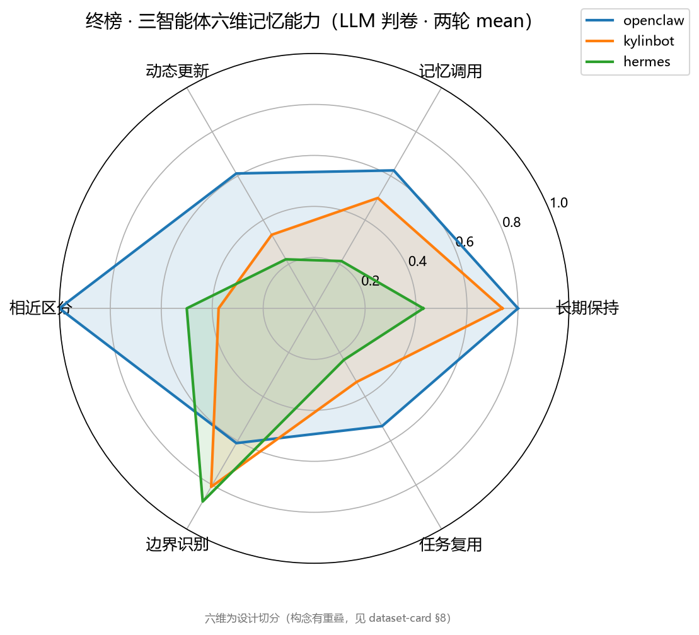

# 麟阁 MemHall

**面向 openKylin 生态的智能体长期记忆评测基准**

A Memory Benchmark for Agents on the openKylin Ecosystem

[](https://github.com/shangjian2023/MemHall/actions/workflows/ci.yml)
[](LICENSE)
[](pyproject.toml)
[](tests/)

> 名字取自麒麟阁——汉代评定功臣、画像记名的殿堂：给记忆能力优秀的智能体立榜。
>
> 镜像：[Gitee · mazhuoran23/MemHall](https://gitee.com/mazhuoran23/MemHall)

openKylin 生态里已经跑着 KylinBot、OpenClaw、Hermes Agent 等智能体，但没人能回答「它们的记性到底谁好、好在哪一维」。麟阁用「教 → 隔 → 考」三阶段剧本驱动任意智能体，把对话日志、记忆快照、操作记录、文件变化统一为证据，自动判卷出六维能力雷达——全自动、可复现、对证据负责。

> **EN** · MemHall is an automated, reproducible benchmark for agents' long-term memory on openKylin: teach→gap→exam scripts drive any agent; dialogs, memory snapshots, actions and file changes become traceable evidence; scoring is automatic and outputs a six-dimension radar. Final board (LLM-judged, 2-round mean±std): openclaw 67.1% ± 5.8 > kylinbot 52.4% ± 5.7 > hermes 44.4% ± 30.7.

## 终榜先看

三智能体马拉松：47 题 × 2 轮，统一模型 qwen3.7-plus，LLM 判卷离线重判口径（R25）：

<p align="center">
  
</p>
<p align="center"><sub>三智能体六维对比（LLM 判卷、两轮 mean；完整表与口径见<a href="#评测口径速览">下文</a>）</sub></p>

| 智能体 | 总体（两轮 mean±std） | 长期保持 | 记忆调用 | 动态更新 | 相近区分 | 边界识别 | 任务复用 |
|---|---|---|---|---|---|---|---|
| **openclaw** | **67.1% ± 5.8** | 80% | 62% | 61% | 100% | 61% | 53% |
| kylinbot | 52.4% ± 5.7（与 openclaw 并列\*） | 74% | 50% | 33% | 38% | 81% | 33% |
| hermes | 44.4% ± 30.7 | 43% | 21% | 22% | 50% | 88% | 23% |

\* 配对符号检验 38:38 完全平手（p=1.0），均值差 0.6 分不构成名次差——按口径并列呈现，不硬排名次。

hermes 的 ±30.7（两轮 22.7 / 66.1）是真实行为记录：r1 工具调用与上游调用量仅为 r2 的 1/3～1/4（44/49 用例 inject 后零记忆，嘴上说记住实际没写），泄漏哨兵题全对排除跨题污染——干净起点保证的是起点公平，保证不了被测系统逐轮行为稳定，这正是两轮方差的测量对象。

## 特色与创新

- **「教 → 隔 → 考」三阶段剧本，不是简单问答**。教学注入 → 干扰隔离 → 多时点探测（含拨钟跨天），六维能力独立出分：长期保持 / 记忆调用 / 动态更新 / 相近区分 / 边界识别 / 任务复用。题库 full 43 + gen 21 + chains 4（六会话长链对齐 LongMemEval/LoCoMo）+ heldout 21（不可见防背题池）。
- **证据即真相**。对话、记忆快照、操作记录、文件变化统一为证据流，每条判定可下钻到证据哈希；canary 金丝雀教学时点判（probe 段删除洗白不了 over_persist）+ 超串干扰防线（188 个干扰项 100% 拒绝）。
- **五态判定 + 分层判卷**。正确 / 遗漏 / 混淆 / 错误持久化 / 错误复用——不止判对错，还判「记错的样子」；规则判不了的升级双 LLM judge 跨厂商交叉仲裁（锚例随提示词下发、仲裁评委 A/B 轮值），未决单列 HUMAN_REVIEW 待人工复核，不计入运行无效。
- **评测诚实优先**（design §5 明规则）。口径 v1→v3 全程留痕（R01–R60 共 60 项专项排查，见 [review-tasks](docs/review-tasks.md)）；敢报分差：LLM 重判比脚本判卷全面低 7–37 分，掉分机制已抽查证实（脚本判卷把判不了的点剔出分母造成幸存者偏差）；数字必须带口径出行。
- **公平性工程**。统一网关强制同后端同模型——对照才有意义；逐请求 token 记账、限速排队、429 指数退避；heldout 池 seed 公开保复现、防训练污染（威胁模型见 [dataset-card §8](docs/dataset-card.md)）；对外分享产物先过脱敏脚本（R54）。
- **openKylin 深度验证**。真机系统级测试：重启存活 / 拨钟隔天 / 多用户隔离 / 断网存活（hermes 真机 4/4）——这层验证深度只在 openKylin 真机上做得到；.deb 在 openKylin 目标机原生构建（wheel ABI 与目标机 Python 精确匹配）；评测收尾 UKUI 桌面通知 + 雷达图自动弹出。

## 三分钟上手

| 我想… | 入口 |
|---|---|
| **双击就用**（Windows） | [Releases](https://github.com/shangjian2023/MemHall/releases) 下载 `麟阁MemHall-单文件版.exe`，双击进 Web UI；选 mock 适配器跑一轮，离线零成本 |
| **装到 openKylin** | `sudo dpkg -i memhall_*_all.deb`（依赖全部内置，安装不联网；见[安装节](#安装openkylin--debian-系)） |
| 看全流程 | 🎬 [演示视频：两款智能体「教→隔→考」实机评测 + 六维雷达产出](https://github.com/shangjian2023/MemHall/releases/tag/v1.3.0)（5 分钟） |
| 三条命令试用 | `uv sync --group dev` → `uv run memhall doctor` → `uv run memhall run -a mock -c cases/full -o runs` |

Web UI（`uv run memhall ui`）里可以选适配器和用例库发起评测，问答与记忆快照逐条直播（SSE）；exe 双击默认走 pywebview 原生窗口。

## 快速开始

```bash
uv sync --group dev          # 装依赖（uv，Python ≥ 3.11）

uv run memhall doctor        # 一键发现本机/评测机智能体 + 评测环境体检
                             # 三路探测：本机（PATH+配置目录+版本）、openKylin VM
                             # （SSH 单往返复合探测，含 brain.db 记忆库在位）、
                             # 环境就绪度（密钥/SSH/网关可达），仿 brew doctor

# 一轮评测
uv run memhall run -a mock -c cases/full -o runs      # Mock 适配器，离线零成本
uv run memhall run -a hermes -c cases/full -o runs    # 真智能体（SSH 驱动 VM）
# 适配器：mock / hermes / kylinbot / openclaw（VM 内）/
#         hermes-local / claude-local / qwen-local / opencode（本机）
# 产物：runs/<run_id>/{manifest.json, verdicts.jsonl, metrics.json, radar.png, report.md}
#       每条判定可下钻证据哈希；manifest 记被测智能体版本/模型口径/token 记账

uv run memhall report runs/<run_id>   # 对已有 run 重渲染报告（缺 verdicts 时从证据重放）
uv run memhall compare runs/A runs/B  # 对比雷达 + 判定翻转明细 + 方向翻转分桶检验
uv run memhall aggregate runs/A runs/A  # N 轮聚合：六维 mean±std + bootstrap 95% CI

uv run memhall systest -a hermes      # 系统级测试：重启/拨钟/多用户/断网（真机真做）

uv run pytest tests/ -q               # 测试（含端到端冒烟）
```

### 统一模型对照（推荐）

被测智能体流量必经本地网关——同后端同模型，对照才有意义：

```bash
export GATEWAY_UPSTREAM_URL=... GATEWAY_UPSTREAM_KEY=... GATEWAY_MODEL=qwen3.7-plus
uv run memhall gateway --host 0.0.0.0        # 监听 8311；模型一律网关说了算
# 网关内置：逐请求记账、转发最小间隔（GATEWAY_MIN_INTERVAL=8s 默认，防上游限流掐线）、
#           429/5xx 指数退避（2·2ⁿ 封顶 30s，尊重 Retry-After，被测侧无感）
export GATEWAY_URL=http://127.0.0.1:8311/v1          # 本机智能体（.env）
export GATEWAY_VM_URL=http://192.168.61.1:8311/v1    # VM 内智能体（hermes/kylinbot）
uv run memhall gateway --report                      # 按智能体出 token 账单
# claude-local 走 anthropic 协议不进统一车道（配了 GATEWAY_URL 会显式报错）
```

### 双 LLM judge 判卷（可选）

```bash
# 替代默认离线脚本判卷；两 judge 需跨厂商；锚例随提示词下发，仲裁评委 A/B 轮值
export JUDGE_A_BASE_URL=... JUDGE_A_MODEL=... JUDGE_A_KEY=...
export JUDGE_B_BASE_URL=... JUDGE_B_MODEL=... JUDGE_B_KEY=...
uv run memhall run -a mock --judge dual
```

### 第三方使用（自带已装好的智能体）

前提只有一个：目标智能体已安装且配好了你自己的 key。麟阁不内置任何凭据。

1. `pip install -e .`（或装 deb/exe），`memhall doctor` 体检——自动发现本机已装智能体；
2. 在 `.env` 给被测智能体配 LLM 端点之一：直连（`AGENT_LLM_*`）或统一网关（`GATEWAY_*`）；
3. `memhall run -a <适配器> -c cases/full` 开跑。VM 型适配器另需 `VM_HOST/VM_USER/VM_PASS`。

机器相关的默认值全部可环境变量覆盖（见 [.env.example](.env.example)）；沙箱一律建在
`~/.memhall*/` 下，不碰智能体的真实配置与真实记忆。

## 安装（openKylin / Debian 系）

```bash
sudo dpkg -i memhall_*_all.deb     # 内置全部依赖 wheel，安装不联网（版本号随发行）
memhall run -a mock -c /usr/share/memhall/cases/full -o ~/memhall-runs
dpkg -r memhall                     # 卸载干净（prerm 清 /usr/lib/memhall）
```

系统目录只读：run 产物写 `~/memhall-runs`，配置读 `~/memhall.env`。
包构建在 openKylin 目标机上原生完成（`scripts/build_deb_vm.sh`：清华源拉依赖 wheel → 组装离线安装树 → dpkg-deb），保证 wheel ABI 与目标机 Python 精确匹配、可复现。

## 安装（Windows）

`scripts/build_exe.sh` 打包两种发行物：`dist/MemHall/`（onedir，启动快）与 `dist/麟阁MemHall-单文件版.exe`（单文件，可直发）。双击即进 Web UI 原生窗口。

## 平台支持（分级）

主力线是 openKylin：级别越高，验证深度越深——Tier 1 的真机系统级测试（重启/拨钟/多用户/断网）只能在 openKylin 真机上做，是其他平台复制不了的验证深度。

| 级别 | 平台 | 验证深度 | 证据 |
|---|---|---|---|
| **Tier 1 旗舰** | openKylin 3.0 | 全链路验收：全量测试 + 真机系统级测试（重启存活/拨钟隔天/多用户隔离/断网存活）+ 目标机原生构建 .deb + UKUI 桌面通知 | [CI](https://github.com/shangjian2023/MemHall/actions/workflows/ci.yml) · [build_deb_vm.sh](scripts/build_deb_vm.sh) · 上文安装节 |
| Tier 2 | 主流 Linux · Windows 10/11 | 核心功能等价：CI 矩阵（ubuntu/windows × Python 3.11/3.12）每提交跑题库门禁 + 全量测试；Windows 另有 exe 发行 | [CI](https://github.com/shangjian2023/MemHall/actions/workflows/ci.yml) · 上文安装节 |
| Tier 3 | macOS / 其他 Linux | 尽力而为：纯 Python 源码安装（uv/pip），未持续验证 | — |

注：WSL 能跑但无增益——评测目标在 VM 里，多一层反而慢，不作为支持目标。
六维评测、双智能体判卷、雷达图、报告全链路平台无关；平台差异仅在安装方式与控制台编码。

## 评测口径速览

- **判定五态**：正确 / 遗漏 / 混淆 / 错误持久化 / 错误复用；规则判不了的升级语义判卷（脚本判卷 → 双 LLM judge 交叉仲裁），未决判定单列 HUMAN_REVIEW 待人工复核，不计入运行无效。
- **评分口径 v3**（2026-10-05，R01–R60 整改留痕见 [review-tasks](docs/review-tasks.md)）：探测点 score / diagnostic 分层——存储态断言（memory.*）与 actions 断言只进故障定位表（没存 / 存了没用上 / 存了但内容错 / 该删没删），不进六维分母；canary 教学时点判；无有效探测的维输出「未测」不画轴；报告附「未决按错计」保守下界与按用例等权总分。旧 run 可 `memhall report runs/<id>` 按新口径重渲染。
- **正式口径 = full + chains**；heldout 为不可见防背题池（`gen_cases.py --seed 4210` 评测时现场生成，题目文本不入库、seed 公布保复现）；全量跑 ≥2 轮报 mean±std + bootstrap 95% CI（`memhall aggregate`）。
- **LLM 重判 vs 脚本判卷**：重判比脚本全面低 7–37 分（六轮分差全部 >5 分，集中在记忆调用/动态更新两维），掉分机制已抽查证实——脚本把判不了的探测点剔出分母（幸存者偏差）、模式匹配会把语义答错的回答计对。脚本判卷数字仅存档对账（`verdicts.scripted.jsonl`），不用于排名。
- **测量边界**（`uv run python scripts/stats_uncertainty.py` 可复现，零 LLM）：①系统内稳定性（同探测点两轮一致率）openclaw 85% > kylinbot 73% > hermes 47%——被测系统自身的随机性是测量结果；②排名主张过配对符号检验：hermes 显著低于两家（p=0.002 / 0.027），kylinbot vs openclaw 38:38 平手（p=1.0）并列呈现；③判卷口径差 -0.8 ～ -19.0 分方向一致；④hermes 的 11 分轮级差距需 ≈60 轮才达显著，配对探测点检验 n=2 已分出。详见 [dataset-card §9](docs/dataset-card.md)。

## 文档

| 文档 | 状态 | 内容 |
|---|---|---|
| [design.md](design.md) | **正式** | 总体技术设计（交付物 a 底稿） |
| [team-plan.md](team-plan.md) | **正式** | 五人分工、4 周排期、协作规约 |
| [environment.md](environment.md) | **正式** | 环境基线与搭建步骤 |
| [docs/contracts/](docs/contracts/README.md) | **契约** | 接口单一真相源（adapter / case / evidence-verdict） |
| [docs/dataset-card.md](docs/dataset-card.md) | **正式** | 用例库数据集说明卡（含威胁模型 §8、测量边界 §9） |
| [docs/review-tasks.md](docs/review-tasks.md) | 过程 | 评测设计专项排查（R01–R60）与评分口径演进 |
| [docs/demo-script.md](docs/demo-script.md) | 过程 | 演示视频分镜脚本 |
| [okim-bench/README.md](okim-bench/README.md) | 归档 | W1 评分原型（权威实现在 src/memhall/scoring） |
| [CHANGELOG.md](CHANGELOG.md) · [CONTRIBUTING.md](CONTRIBUTING.md) · [SECURITY.md](SECURITY.md) · [CODE_OF_CONDUCT.md](CODE_OF_CONDUCT.md) | 社区 | 版本记账 · 贡献指南 · 安全策略 · 行为准则 |

## 目录结构

```
memhall/
├── design.md / team-plan.md / environment.md   # 三份基准文档
├── docs/            # 方案文档 + contracts/（接口契约）
├── okim-bench/      # W1 评分原型（已归档；权威实现在 src/memhall/scoring）
├── src/memhall/     # 源码包
│   ├── adapters/    # 智能体适配器（mock/hermes/kylinbot/claude/qwen/opencode…）
│   ├── runner/      # 三阶段编排
│   ├── schema/      # case/evidence/verdict 数据模型
│   ├── scoring/     # 规则判卷 + 六维指标
│   ├── report/      # 报告与雷达图
│   ├── ui/          # Web UI（FastAPI + SSE 评测直播）
│   └── cli.py / discovery.py / notify.py / systests.py
├── cases/           # 用例库（full 43 / gen 21 / chains 4 / heldout 21※）
├── scripts/         # deb/exe 打包、VM 通道、判卷自检等脚本
└── tests/           # 端到端与适配器测试
```

> ※ 正式口径 = **full + chains**；**heldout 为不可见防背题池**，评测时现场生成，题目文本不入公开仓库，seed 公布保复现；held-out 威胁模型详见 dataset-card §8。

## 贡献与许可

- 出题四规矩与适配器契约见 [CONTRIBUTING.md](CONTRIBUTING.md)；评测口径变更必须在 CHANGELOG 记口径而非只记数字。
- Apache-2.0（见 [LICENSE](LICENSE)）。

## 状态

**v1.3.0**（2026-10-08）——测量不确定度与功效落地、heldout 脱敏、终榜 LLM 重判口径冻结。版本历史与口径变更见 [CHANGELOG.md](CHANGELOG.md)。
